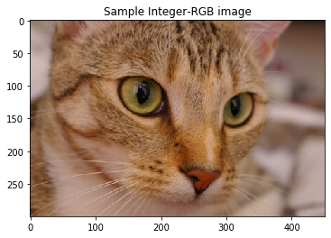
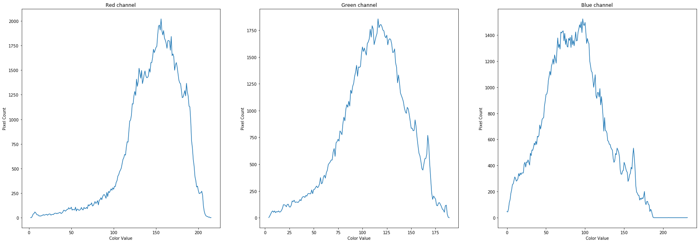

# Scikit Image Exposure - Histogram
### Description:
Histogram module is a part of the Patternflow library containing the tensorflow port of the histogram algorithm from the exposure module of scikit-image (https://scikit-image.org/docs/stable/api/skimage.exposure.html#skimage.exposure.histogram).
The module contains a 'histogram' function which calulates and returns the histogram for the color values in a given image. The function returns the centers of the bin and does not rebin integer arrays. This algorthim focuses to improve speed and intensity resolution over a regular histogram implementation for images with integer color values by assigning each integer value it's own bin.
### Dependencies:
Tensorflow >= 1.10
### Usage:
The histogram function takes 5 arguments, where 4 out 5 arguments are optional
  - Image: The input image array.
  - nbins: (optional)The number of bins used to calculate histogram, default value is 256 and this parameter is ignored for integer valued images arrays.
  - normalize: (optional) A boolean value which specifies to normalize the histogram using the sum of it's values, default value is False.
  - sess: (optional) A tensorflow session object to perform tensor operations. It is recommended to pass a tensorflow session if the script/module calling the function is already using a tensorflow session to avoid opening multiple sessions, Default value is None.
  - as_tensor: (optional) A boolean value which specifies whether to return the results of the function as tensor or not, Default value is true.
 
The function calculates and returns the histogram and bin centers for the given image array. The histogram is computed seperately on the flattened image, Therefore, for color images the function should be used seperately on each channel for obtaining histograms for each channel.
##### Example:
Histogram calculation for a Grayscale image with float colour values
```sh
from skimage import data, img_as_float
from Histogram import histogram
# import image
image = img_as_float(data.camera())
# calculate histogram
histogram(image, nbins=2)
>>>(array([107432, 154712], dtype=int32), array([0.25, 0.75]))
```
Histogram calculation for a RGB image with integer color values:
```sh
from Histogram import histogram
from skimage import data
import matplotlib.pyplot as plt

# import RGB image with integer color values
image = data.chelsea()
plt.imshow(image)
plt.title('Sample Integer-RGB image')
plt.show()
```

```sh
# red channel
red = image[:,:,0]
# green channel
green = image[:,:,1]
# blue channel
blue = image[:,:,2]

# plot histograms for all colour channels
channel = ['Red', 'Green', 'Blue']
fig = plt.figure(figsize=(30,10))
for i in range(3):
    ax = fig.add_subplot(1, 3, i+1)
    histograms, bins = histogram(image=image[:,:,i])
    ax.plot(bins, histograms)
    ax.set_title(channel[i]+' channel')
plt.show()
```


For more examples see example driver script.
```sh
python3 example_driver.py
```
