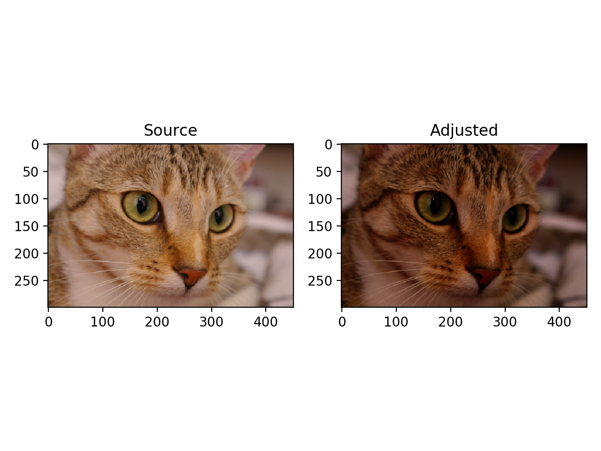

# Gamma Correction

This is a Tensorflow porting of the scikit-image [adjust_gamma](https://scikit-image.org/docs/stable/api/skimage.exposure.html#skimage.exposure.adjust_gamma) function.

## Description

This algorithm performs Gamma correction on the input image.
From Wikipedia: "Gamma correction, or often simply gamma, is a nonlinear operation used to encode and decode luminance or tristimulus values in video or still image systems"[1].

Also known as Power Law Transform, this function transforms the input image pixelwise according to the equation `O = I**gamma` after scaling each pixel to the range 0 to 1.

## Example of usage

```python
from skimage import data, img_as_float
from adjust_gamma import adjust_gamma

image = img_as_float(data.chelsea())
adjusted = adjust_gamma(tf.cast(image, tf.float64), gamma=2)
```

Result:




## References
[1] [Gamma correction - Wikipedia](https://en.wikipedia.org/wiki/Gamma_correction)