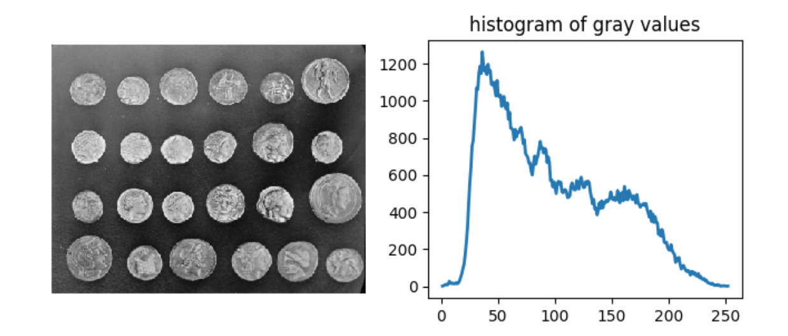

# Tensorflow implementation of gaining a histogram of an image

The histogram produced is a representation of the tonal distribution of the flattened image.
For each tonal value, the count of the number of pixels for this tonal value is computed. By
viewing the histogram, the entire tonal distribution is given at a glance. Note that for colour images, each channel should be independently input to gain a histogram for each colour channel. 

The algorithm works by first flattening the image to a one dimensional array of values. For
colour images, this is applied to a given channel. Next, the range of values is determined
based on the input parameter `source_range`. The flattened image is casted to float values 
and input into Tensorflow's histogram value and bin functions. The bin centres are then 
computed from the bin edges. Lastly, if the `normalize` parameter is set True, then each value is  normalized by the sum of the all the values. 

# Example Output
 

## Comparison to skimage histogram algorithm:
 

