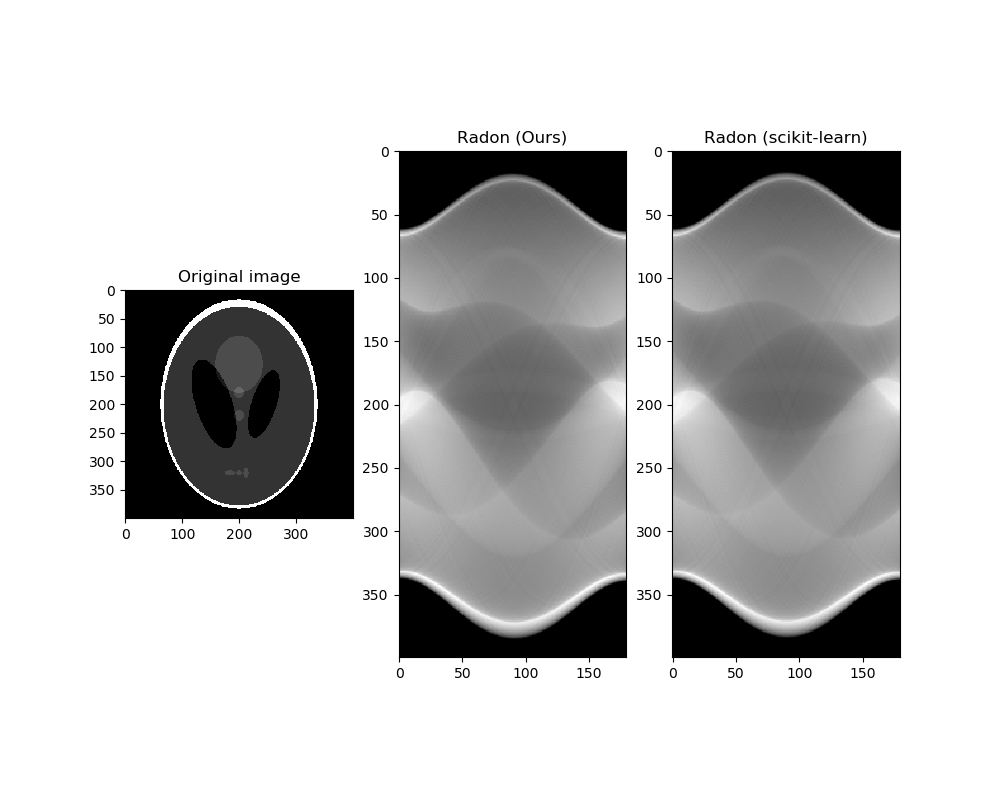

# Radon transform
The Radon transform, ported to TensorFlow. Uses TensorFlow's builtin NumPy datatypes via Keras for convenient, fast image manipulation.

# Description
The output of the Radon transform on a certain linethe line integral of the projection of an image onto that line.

# How it works
The function takes in several inputs, `image`, which is a 2D image with a third dimension for thannels, which is converted into grayscale. The second argument is `theta`, which is a list of the angles the of the lines of the Radon transform that will be returned.THe third argument `circle` is `True` if the image fits fits inside the curcle inscribed in the square.  
The code for toc rip the image is taken directly from the original scikit function.. It takes the image, and either crops off an appropriate amount off the ends on one axis to make it the same length as the other axis, or leavevs the axis as is when it is the same size as the smallest axis (when the slice index is `None`).  
To implement this, the image is rotated by using an affine transform function to make the line horizontal, and the columns are summed to give the (discrete) line intergral.

# Example
This is output from `example.py`.
