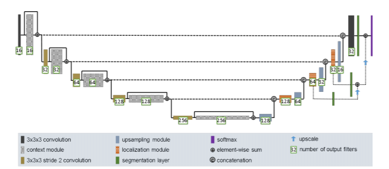

# Problem:
This implementation solves the recognition problem to segment the ISIC dataset with an improved Unet architecture 

## Dataset description:
The dataset contains both segmented and raw images of skin patches to detect areas with melanoma(skin cancer). The aim of this deep neural network is to train on a subset of this dataset and then segment test images to identify areas with melanoma.The images in the dataset were of different sizes, which was then modified in the pre-processing stage to fit into the model.

## Data Preprocessing:
1. To read the files of the images, glob library of python has been used here. After that, the files were sorted in an ascending index order so that there is no mismatch and input and target labels.
2. All the images have been resized to (256,256) size to have uniformity.
3. The segmented images were stored as y or target variable and others as x.
4. As the target variable,y, had various unique labels from 0 to 255 owing to different representations in grey scale, the variable was scaled and rounded off so that the unique values were 0(background or normal skin) and 1 (patch or detected melenoma area).
5.For splitting the data into train, validation and test data, sklearn's 'train_test_split' function has been used, herein, 20% data was left out as test data and 80% was separated as training data( out of which 25% was used as validation data).A random state was also used for reproducibility of results.

## ModelArchitecture
The model used for this classification is an improved u-net structure taken from the research paper as cited in the *reference* section at the end.
The architecture image is as follows-

According to it-
1. The basic idea of this architecture is to implement a "U" shaped model, wherein, the input images are first downsampled by reducing their spatial dimensions(at the same time increasing the filters) and then they are upsampled back into their original size.Throughout the course, the model learns and carries out the process of segmentation of the image.

2. For the downsampling or the contraction part in this model, there are blocks of context modules,in each of these blocks, there are two convolutional layers, in between which there is also a dropout layer to avoid overfitting.

3.Every two context modules in the downsampling part are connected by a convolutional layer with a stride of two for reducing the spatial volume as we go deeper into the network.

4. For upsampling or the expansion part,upsampling2d layers have been used to increase the spatial dimensions. The output of this is then concatenated with corresponding layers of the downsampling part, which is then followed by  localization modules. Each localozation module consists of a  33 convolutional layer and a 11 convolutional layer.

5. Towards the end of the architecture, different segmented layers have  been merged using element wise summation to administer results more precisely.

6.In the model, "Leaky Relu" has been used as it is faster than its conventional counterparts.

7. As the aim was to do a binary classification, I used a "sigmoid" activation function in the final layer as it produces desirable activation results.

## Model Parameters and tuning
1. While compiling the model, the loss function used is "binary_crossentropy" 
2. I used adam optimiser with a small learning rate of 5(e^-4) to avoid converging to any local minimas.
3. Epochs- This refers to the total to and fro iterations through the network during the training phase. In this model, I used 40 epochs because anything more than that did not reduce the validation loss any further suggesting that the model has started overtraining.
4. Batchsize- I used batches of 8 in the model.
 

## Model Result Evaluation 
1. The first thing, that I did to see the results of the model was to make predictions on the test set.
2. To determine the dice similarity coefficient, I implemented a simple logical function to check for overlapping of melonoma patches in the skin images, and got the value to be 0.815-

3. The accuracy of the model is 94.65%
4. For comaprision below attached are a sample predicted output and its ground truth-
4.1. predicted image-

4.2. Actual image-

5. visualisation of loss and accuracy plots during training-

## Implementation timeline
## Reference
F. Isensee, P. Kickingereder, W. Wick, M. Bendszus, and K. H. Maier-Hein, “Brain Tumor Segmentation and
Radiomics Survival Prediction: Contribution to the BRATS 2017 Challenge,” Feb. 2018. [Online]. Available:
https://arxiv.org/abs/1802.10508v1

