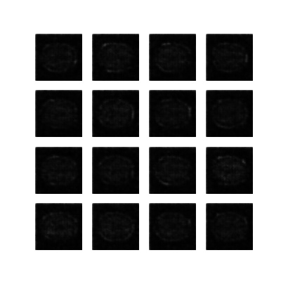
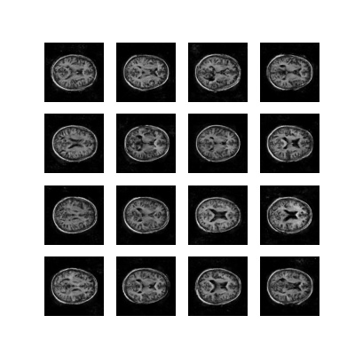

# DCGAN on OASIS brain dataset
Based on tf 2.1 implementation of Deep Convolutional Generative Adversarial Networks(DCGAN) with OASIS brain dataset.

This work is aimed to create a generative model of the OASIS brain with a “reasonably clear image" and get a 
[Structured Similarity (SSIM)](https://en.wikipedia.org/wiki/Structural_similarity) of over 0.6.

## Dataset
OASIS brain dataset is provided by COMP3710 Course Staff. All the images are of 256 * 256 resolution in grayscale, and 
have been rescaled to 128 * 128 resolution in data processing.

## Model
For the implementation of DCGAN model refers to the 
[TensorFlow DCGAN Tutorial](https://www.tensorflow.org/tutorials/generative/dcgan),
and its theory refers to [Generative Adversarial Nets](http://papers.nips.cc/paper/5423-generative-adversarial-nets.pdf)
and [UNSUPERVISED REPRESENTATION LEARNING WITH DCGAN](https://arxiv.org/pdf/1511.06434.pdf).
In general, a GAN's framework contains 2 nets called Generator(G) and Discriminator(D). In each epoch, G
will receive a certain number of random noises z and generate same number of images represented as G(z). 
Then D will discriminate those images and get a probability for each image of it is from real image. This probability
is represented as D(G(z)). In the training process, our purpose is to minimize G and maximize D, and that is the
adversarial training process. After that, we could get a generator model to generate fake but looks-real figures.

## Usage 
For training mode:

`python main.py train`

To run the training model will train a new DCGAN model on the dataset in direction `TRAIN_DIR`, and save checkpoints in 
the direction `CHECKPOINT_DIR`. The images generated during training are stored in 'gen_im' and a .gif figure will be 
created for visualization. Then generating 16 samples for testing with the testing dataset in direction `TEST_DIR`. 
You should modify all the paths to your own directions and detailed dataset loading can be found in `dataset.py`.

For test only mode:

`python main.py test`

To run test only model will restore the last checkpoint from last training model. Then generating samples and testing
model as training mode. 

Hints: Make sure you have correct path setting and it is not empty when reading from it. Otherwise, the errors occur.

## Results
Following are training results of OASIS brain reshaped images with 128 * 128 resolution(original in 256*256). Checking
`config.py` for more detailed configuration and modifying it as you needs.

Generated brain images in 40 epochs training process.

Generated 16 samples of trained model.

SSIM is measured from the maximum value of each sample comparing with all the test images. In most cases, the best SSIM
of 16 samples could be higher than 0.6

