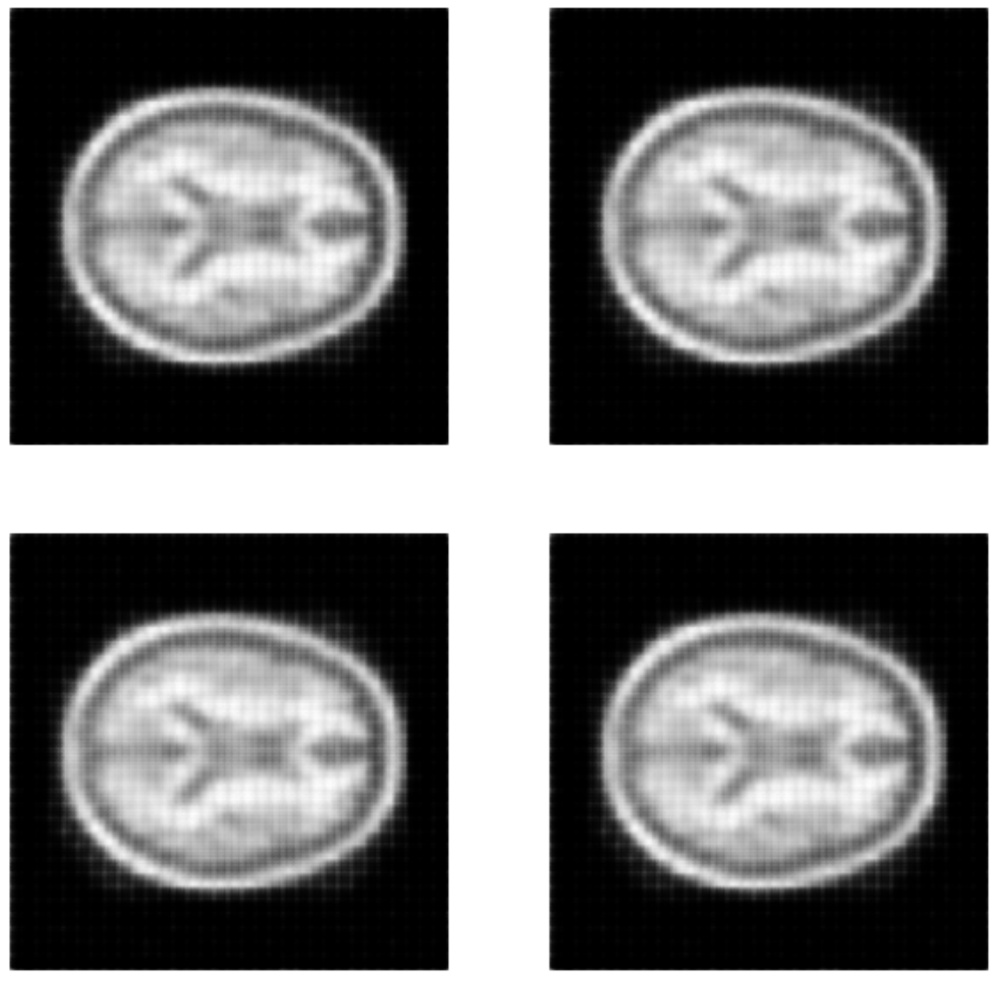

# Variational Autoencoder

## Overview
To generate brain images, the algorithm I applied is Variational Autoencoder. 
In the scenario of computer vision, an autoencoder is trained to learn the latent 
representation (or a single point) of an image in a reduced dimension. 
However, rather than using a fixed vector to compress images, a Variational Autoencoder 
learns to compress the images into a range of possible values (i.e., a probability distribution). 
Then we sample vectors (points) from the latent distribution produced by the 
encoder and feed them to the decoder to generate brain images. 
A Gaussian distribution is used to model the latent representation.

## Dependencies
### Tensorflow: 
To install Tensorflow, use the following command:
```
pip install tensorflow
```

### matplotlib
To install matplotlib, use the following command: 
```
pip install matplotlib
```

## Dataset Preparation
Since VAE is an unsupervised learning technique, we do not need too many test images. 
In my implementation, the training set, test set, validation set contain 9664, 544, 1120 images respectively.
The model fits on the training set. The test set is used to evaluate the model performance. 
The validation set is used to fine tune the hyperparameters, e.g., stride, kernel size.

## Architecture
The encoder and decoder have three layers. After fine tuning, each layer has 16, 32, 63 filters respectively. 
The stride size and kernel size are 2  Deep architectures can yield better compression result compared to shallow ones.

## Training
In each epoch, the model is trained on the same 9664 images. 
The generated images are evaluated by SSIM.
The SSIM and ELBO (Evidence Lower Bound) after the first epoch are 0.4773 and 17951.17. 
Let’s plot four of the images generated in the first epoch below.

After 30 epochs, the SSIM and loss are 0.6467 and 17051.21. Let’s plot four of the generated images：

The ELBO and SSIM over the 30 epochs are shown below. 


## Running Code
To run the project, execute `driver.py` located in `Patternflow/recognition/VAE/` 
using the following command:
```
python driver.py arg1 arg2
```
where arg1 is the directory stores the training images and 
arg2 is the directory stores the testing images.
Below is an example:
```
python driver.py keras_png_slices_data/train keras_png_slices_data/test
```
where `keras_png_slices_data/train` stores the training images and 
`keras_png_slices_data/test` stores the test images.


## Author
Yunke QU. Student ID: 44631604.
 