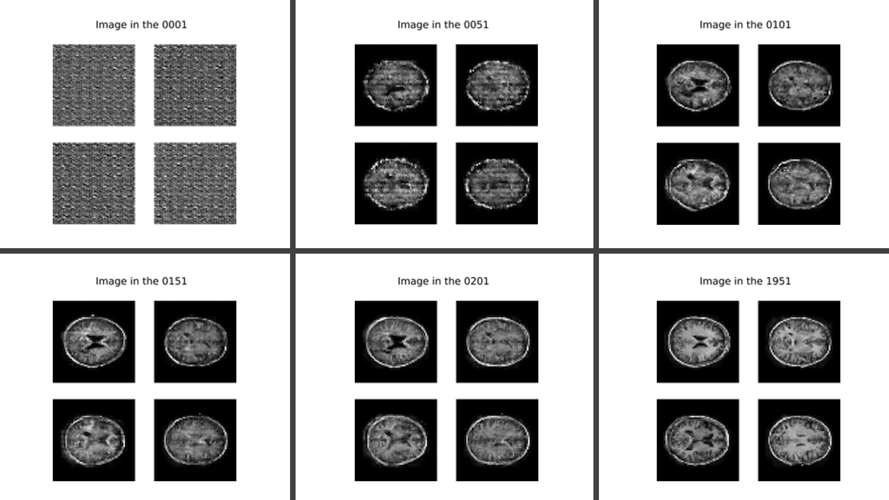
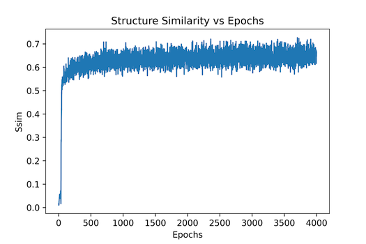

# A tensorflow implementation of  DCGAN


## Discription 

### The model

Deep Convolution GAN (DCGAN) include two models : generator and discriminator.

The generator creates new images and tries to fool the discriminator. 

The discriminator learns how to judge fake images from real images. 

The uniqueness of DCGAN (compared with GAN) :

 	1. Use batchnormlise in both the generator and the discriminator.
 	2. Remove fully connected hidden layers for deeper architectures
 	3. Use ReLU activation in generator for all layers except for the output, which uses Tanh.
 	4. Use LeakyReLU activation in the discriminator for all layers.

### Problem Solved

Use OASIS brain data set to build a DCGAN model. 

The generator model of the DCGAN will create a reasonably fake images and ensure the structured similarity is 0.6 


## How the model works

<div align="center">
  <h3>The flowchart of the  process</h3>
  
  <br><br><br>
  <h3>The Structure of Generator</h3>
  
  <br><br><br>
  <h3>The Structure of Descriminator</h3>
  
</div>


Three figuers above show the sturcture of generator and descriminator. 

The generator model has :

​	one dense layer (conver input noise(100) into (8*8*256) and reshape it into size 8 x 8 x 256)

​	three transpose convolutional layers (2 x 2 kernel size) asociated with LeakyReLU and BatchNormalization layers

The descriminator model has:

​	two 3x3 convolutional layers, LeakyReLU layers and dropout layers with p=0.3.


## Python code to Build two models

```python
def make_generator_model():
  """The output is image """
    model = tf.keras.Sequential()
    model.add(layers.Dense(8*8*256, use_bias=False, input_shape=(100,)))
    model.add(layers.BatchNormalization())
    model.add(layers.LeakyReLU())
    
    model.add(layers.Reshape((8, 8, 256)))

    model.add(layers.Conv2DTranspose(128, (2,2), strides=(2, 2), 
                                     padding='same', use_bias=False))
    model.add(layers.BatchNormalization())
    model.add(layers.LeakyReLU())
    
    model.add(layers.Conv2DTranspose(64, (2, 2), strides=(2, 2), 
                                     padding='same', use_bias=False))
    model.add(layers.BatchNormalization())
    model.add(layers.LeakyReLU())
    
    # in DCGAN the activation function is tanh
    model.add(layers.Conv2DTranspose(1, (2, 2), strides=(2, 2), 
                                     padding='same', use_bias=False, activation='tanh'))
    assert model.output_shape == (None, 64, 64, 1)
    
    return model


def make_discriminator_model():
  """The output is a float indicate if the picture is real or fake """
    model = tf.keras.Sequential()
    model.add(layers.Conv2D(64, (3, 3), strides=(2, 2), padding='same',input_shape=[64, 64, 1]))
    model.add(layers.LeakyReLU())
    model.add(layers.Dropout(0.3))

    model.add(layers.Conv2D(128, (3, 3), strides=(2, 2), padding='same'))
    model.add(layers.LeakyReLU())
    model.add(layers.Dropout(0.3))

    # fully connected
    model.add(layers.Flatten())
    model.add(layers.Dense(1))

    return model
```

​	

## Dependencies required

  1. Python 3.7 

  2. Tensorflow-gpu 2.1.0

  3. Keras

  4. OpenCv

  5. IPython

     

## Data

1. The given train data is 9664 brain images. Before training the model, The training dataset will be shuffled and all

   images will be resized into shape (64,64) and changes into gray scale.

2. The model will be tested by generating 32 images and compare it with 32 real images. (since the nmber of slice is 32)


## Example outputs





## Result

Structural Similarity(SSIM) Index will be used to validate the generated images. 

Our purpose is to get the  SSIM is over 0.6

The plot below show how the  structure similariy changes 



1. The  SSIM changes up and down around 0.6 after 50 epochs.
2. During the whole training process, the max value of ssim is 0.727

