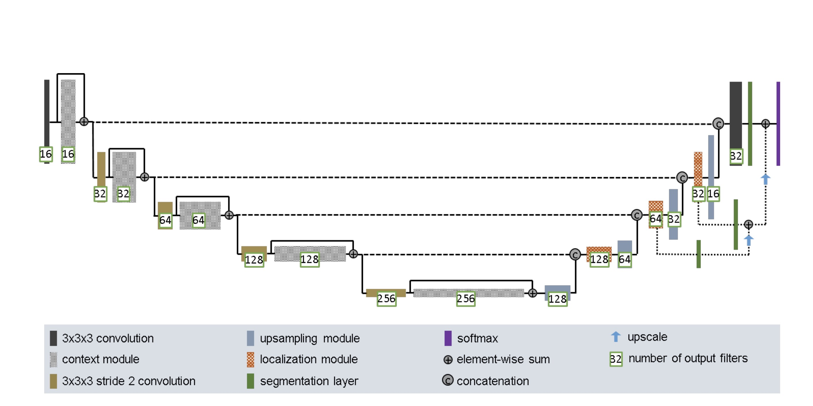

# Segment the ISICs data set with the Improved UNet
Image segmentation of ISICs data set implemented for tensorflow

## Description

ISICs data set concludes thousands of Skin Lesion images. This recognition algorithm aims to automatically do Lesion Segmentation through an improved unet model [[1]](#References). The evaluation of segmentation has a [Dice similarity coefficient](https://en.wikipedia.org/wiki/Sørensen–Dice_coefficient) of 0.84 on the test set. 

Here is a exmaple of the original Skin Lesion image and its Ground Truth segmentation image.

​                                                                       

  Figure 1. Left is original Skin Lesion image and the right is its ground truth image.

To conclusion, the aim of this project is to create the segmentation image like the above right one from an input image like the above left one by a kine of uNet model.

## uNet Structure

The uNet Structure is almostly from the structure in [[1]](#References).

  Figure 2. The structure of the improved uNet 

The difference is that images in ISICs data set are 2D dimensions, and so all $3\times 3\times 3$ convolution layers have been changed to $3\times 3$ convolution layers.

**Context module**: InstanceNormalization, ReLu, $3\times 3$ convolution, InstanceNormalization, ReLu, $3\times 3$ convolution, Dropout(0.3).

**Upsampling module**: UpSampling2D(), $3\times 3$ convolution

**Localization model**: $3\times 3$ convolution, $1\times 1$ convolution

**Segmentation layer**: $1\times 1$ convolution by 2 output filters

**Upscale**: UpSampling2D() by bilinear interpolation

**Optimizer**: Adam

**Loss**: sparse_categorical_crossentropy

**Metrics**: accuracy

## References

[1] F. Isensee, P. Kickingereder, W. Wick, M. Bendszus, and K. H. Maier-Hein, “Brain Tumor Segmentation and Radiomics Survival Prediction: Contribution to the BRATS 2017 Challenge,” Feb. 2018. [Online]. Available: https://arxiv.org/abs/1802.10508v1

