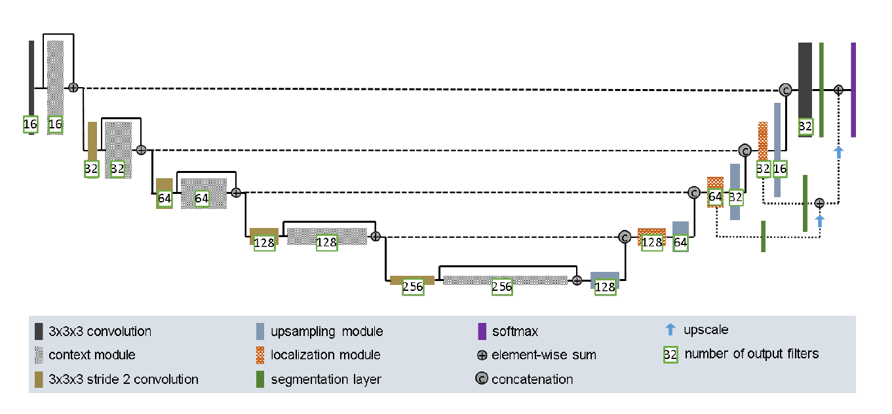

# **Segment the ISICs data set with the Improved UNet**
## Problem
The problem is to build an Improved UNet model. And Segment the ISICs data set with all labels having a minimum Dice similarity coefficient of 0.8 on the test set.
      
##  Algorithm
The algorithm is to implement a "U-shape" model

The input is the normalized image data which resized to (256,256), and split it into train, validation and test dataset. 

The Encoder is built with context modules, which lets the UNet go deeper.

The Bridge is built with upsampling modules, which reduces the number of feature maps.

The Decoder is built with localization modules, which reduces the number of feature maps and let the data be original size.
## How it works
 
The context module consists two convolutional layers(convolution kernel is 3 × 3 and padding is 1). And there is a dropout layer to avoid overfitting.Besides, Relu is the activation layer.

The upsampling modules is a unsampling2D layer.

The localization module is a convolutional layer.

## Dependency 
- Python = 3.7
- Tensorflow = 2.1.0
- Tensorflow-Addons
## Example 
```python
def  improved_unet(h, w):
	inputs = Input((h,w,3))
	conv1 = Conv2D(16, (3,3), padding='same')(inputs)
	cm1 = context_module(conv1, 16)
	add1 = Add()([conv1, cm1]) # concat later
	conv2_stride = Conv2D(32, (3,3), strides=2, padding='same')(add1)
	cm2 = context_module(conv2_stride, 32)
	add2 = Add()([conv2_stride, cm2]) # concat later
	conv3_stride = Conv2D(64, (3,3), strides=2, padding='same')(add2)
	cm3 = context_module(conv3_stride, 64)
	add3 = Add()([conv3_stride, cm3]) # concat later
	conv4_stride = Conv2D(128, (3,3), strides=2, padding='same')(add3)
	cm4 = context_module(conv4_stride, 128)
	add4 = Add()([conv4_stride, cm4]) # concat later
	conv5_stride = Conv2D(256, (3,3), strides=2, padding='same')(add4)
	cm5 = context_module(conv5_stride, 256)
	add5 = Add()([conv5_stride, cm5])
	um1 = upsampling_module(add5, 128)
	concat1 = concatenate([um1, add4])
	lm1 = localization_module(concat1, 128)
	um2 = upsampling_module(lm1, 64)
	concat2 = concatenate([um2, add3])
	lm2 = localization_module(concat2, 64) # addup later
	um3 = upsampling_module(lm2, 32)
	concat3 = concatenate([um3, add2])
	lm3 = localization_module(concat3, 32) # addup later
	um4 = upsampling_module(lm3, 16)
	concat4 = concatenate([um4, add1])
	conv6 = Conv2D(32, (3,3), padding='same')(concat4) # addup later
	seg1 = Conv2D(1, (1,1), padding='same')(lm2)
	seg1 = UpSampling2D(size=(2,2))(seg1)
	seg2 = Conv2D(1, (1,1), padding='same')(lm3)
	sum1 = Add()([seg1, seg2])
	sum1 = UpSampling2D(size=(2,2))(sum1)
	seg3 = Conv2D(1, (1,1), padding='same')(conv6)
	sum2 = Add()([sum1, seg3])
	outputs = Activation('sigmoid')(sum2)
	network = tf.keras.Model(inputs = [inputs], outputs = [outputs])
	return network
```

 
Average DSC:  0.8534447895381826

## Reference
1. F. Isensee, P. Kickingereder, W. Wick, M. Bendszus, and K. H. Maier-Hein, “Brain Tumor Segmentation and
Radiomics Survival Prediction: Contribution to the BRATS 2017 Challenge,” Feb. 2018. [Online]. Available:
https://arxiv.org/abs/1802.10508v1