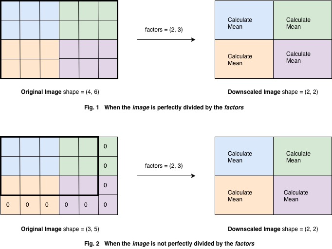
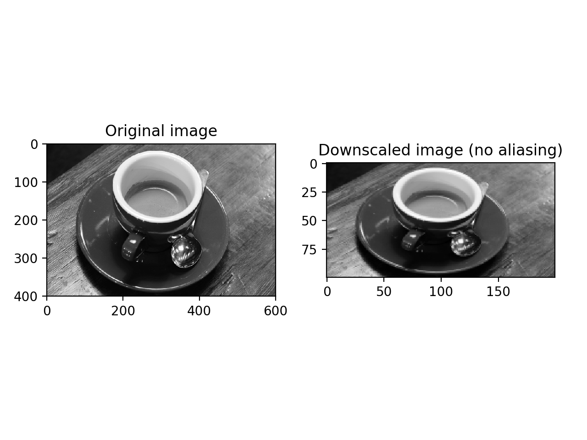

# Transforms: _**downscale_local_mean**_

<font color=#F08080>_**downscale_local_mean(image, factors, cval=0)**_</font>

## **Description**
This function is used to down_sample N-dimensional image by local averaging. It calculates the local mean of elelments n each block of size _factors_ in the input image.

The image is padded with _cval_ if it is not perfectly dividible by the integer factors.

This function is equvalent to <font color=#FF6347>_skimage.transform.downscale_local_mean_</font> function.

#### Parameters
> **image**: ndarray   
> &emsp; N-dimensional input image.   
> **factor**: array_like   
> &emsp; Array containing down-sampling integer factor along each axis.   
> **cval**: float, optional   
> &emsp; Constant padding value if image is not perfectly divisible by the integer factors.

#### Returns
> **image**: ndarray   
> &emsp; Down-sampled image with same number of dimensions as input image. 

## **Principles**
_Downscale_local_mean_ serves the purpose of down-sampling an n-dimensional image by integer factors using the local mean on the elements of each block of the size factors given as a parameter to the function.

The following picture displays how the _downscale_local_mean_ function works in the situations '_image_ is perfectly divided by _factors_' and '_image_ is not perfectly divded by _factors_ (with _cval_ being 0)'.



## **Examples**
#### Example1
# TODO: explanation of the example
```python
>>> a = np.arrage(15).reshape(3, 5)
>>> a
array([[  0,  1,  2,  3,  4],
       [  5,  6,  7,  8,  9],
       [ 10, 11, 12, 13, 14]])
>>> downscale_local_mean(a, (2,3))
array([[ 3.5, 4. ],
       [ 5.5, 4,5]])
```
#### Example2
# TODO: explanation of the example
```python
import matplotlib.pyplot as plt

from skimage import data, color
from downscale_local_mean import downscale_local_mean

image = color.rgb2gray (data.coffee())
image_downscaled = downscale_local_mean(image, (4, 3))
fig, axes = plt.subplots(nrows=1, ncols=2)

ax = axes.ravel()

ax[0].imshow(image, cmap='gray')
ax[0].set_title("Original image")

ax[1].imshow(image_downscaled, cmap='gray')
ax[1].set_title("Downscaled image (no aliasing)")

ax[0].set_xlim(0, 600)
ax[0].set_ylim(400, 0)
plt.tight_layout()
plt.show()
```


