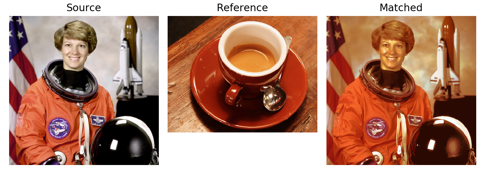

Transform module 
====
match_histograms function implementation in Tensorflow
-------
# Description of the algorithm
The function of this algorithm is: Adjust an image so that its cumulative histogram matches that of another iamge. Specifically, firstly, after giving the reference image and the source image. By calculating the cumulative distribution of the reference figure, the probability distribution of each pixel value of the figure can be obtained. Secondly, for each channel, give the information of the reference figure, and use the interpolation function to get the value corresponding to a series of source pictures. Finally, the results of each channel are reconstructed into a figure to achieve the effect of color migration.

# How it works
You can run run main.py directly to see the effect of the image color style migration. If you want to use your own image, you need to replace the reference and source in main.py with the path to your image. If you want to see how the specific function is written, you can open match_histograms.py to view it.

# Example 
```python
reference = data.coffee()
source = data.astronaut()
image1  = tf.convert_to_tensor(image1)
image2 = tf.convert_to_tensor(image2)
matched = mh.match_histograms(image1, image2, multichannel=True)
fig, (ax1, ax2, ax3) = plt.subplots(nrows=1, ncols=3, figsize=(8, 3),
                                    sharex=True, sharey=True)
for aa in (ax1, ax2, ax3):
        aa.set_axis_off()

ax1.imshow(image1)
ax1.set_title('Source')
ax2.imshow(image2)
ax2.set_title('Reference')
ax3.imshow(matched)
ax3.set_title('Matched')
plt.tight_layout()
plt.show()
The example of completing color migration of astronaut image
```



# Dependencies

This project is tested in following context:

- macOS Catalina 10.15
- python 3.7.3


Author: Tianjie Shi 
