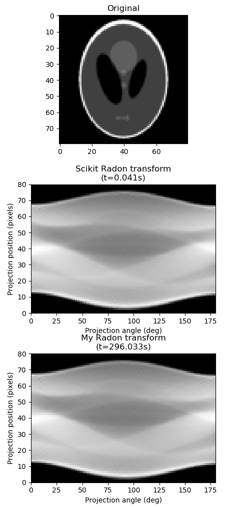

<!-- [](https://travis-ci.org/microwen/PatternFlow) -->

<!--  -->

# Radon Transform in Tensorflow

This is a python implementation of [radon transform](https://scikit-image.org/docs/dev/auto_examples/transform/plot_radon_transform.html) from the [`transform`](https://github.com/siraferradans/scikit-image-temp/tree/master/skimage/transform) package of [scikit-image](https://scikit-image.org/) ported to [Tensorflow](https://www.tensorflow.org/). 

The definition of radon transform can be found [here](https://en.wikipedia.org/wiki/Radon_transform#Definition) and [here](http://mathworld.wolfram.com/RadonTransform.html). 

## Algorithm Description

In summary, this algorithm takes a grayscale image as input and apply the radon transformation to the image which is the output. The resolution of the transform is specified by another input which is the angles (in an array-like object). 

The output of the algorithm is the intensity in the transformed space whose height is the size of the original image and width is the range of the given angles. 

A comparison of the scikit image implementation and the ported algorithm is shown below. 



To verify the algorithm has been successfully ported, the inverse radon transform is performed on both implementations to reconstruct the original image. The error is also calculated for each reconstruction. 


As a result, it is no noticable difference with exact same value for error indicates the radon transformation algorithm has successfully being ported to Tensorflow.

## Requirements

The dependencies of this algorithm is listed below (and in the `requirements.txt` file).

```python
tensorflow==2.0.0
```

To install the dependencies, run the following commands,

```bash
pip install -r requirements.txt
```


## Example Usage

```python
import time
import numpy as np
import matplotlib.pyplot as plt

from skimage.io import imread
from skimage import data_dir
from skimage.transform import radon, iradon, rescale

from radon_transform import radon as my_radon

# Load the image from scikit-image
image = imread(data_dir + "/phantom.png", as_gray=True)
image = rescale(image, scale=0.2, mode='reflect', multichannel=False)

fig, (ax1, ax2, ax3) = plt.subplots(3, 1, figsize=(4.5, 12))

# Plot original image
ax1.set_title("Original")
ax1.imshow(image, cmap=plt.cm.Greys_r)

# Specify the angles
theta = np.linspace(0., 180., max(image.shape), endpoint=False)

# Plot scikit-image sinogram
tic = time.time()
sinogram = radon(image, theta=theta, circle=True)
toc = time.time()
ax2.set_title("Scikit Radon transform\n(t={0:.3f})".format(toc - tic))
ax2.set_xlabel("Projection angle (deg)")
ax2.set_ylabel("Projection position (pixels)")
ax2.imshow(sinogram, cmap=plt.cm.Greys_r,
        extent=(0, 180, 0, sinogram.shape[0]), aspect='auto')

# Plot the sinogram from the ported algorithm
tic = time.time()
my_sinogram = my_radon(image, theta=theta, circle=True)
toc = time.time()
ax3.set_title("My Radon transform\n(t={0:.3f})".format(toc - tic))
ax3.set_xlabel("Projection angle (deg)")
ax3.set_ylabel("Projection position (pixels)")
ax3.imshow(my_sinogram, cmap=plt.cm.Greys_r,
        extent=(0, 180, 0, my_sinogram.shape[0]), aspect='auto')

# Display the plot
fig.tight_layout()
plt.show()
```

### Future Work

It is noticed that the performance of the ported algorithm is significantly worse than the original algorithm in scikit-image. Upon profiling on the algorithm,

```
  my_sinogram = my_radon(image, theta=theta, circle=True)
         49352827 function calls (49339197 primitive calls) in 296.034 seconds

   Ordered by: cumulative time

   ncalls  tottime  percall  cumtime  percall filename:lineno(function)
        1    0.122    0.122  296.034  296.034 radon_transform.py:437(radon)
       80   25.677    0.321  295.470    3.693 radon_transform.py:335(_warp_fast_tf)
   512000   74.465    0.000  220.618    0.000 radon_transform.py:220(_bilinear_interpolation_tf)
   378372   10.277    0.000   80.097    0.000 math_ops.py:922(r_binary_op_wrapper)
   387601    2.120    0.000   73.365    0.000 ops.py:1187(convert_to_tensor_v2)
   387692    9.476    0.000   71.258    0.000 ops.py:1249(internal_convert_to_tensor)
  2048000   34.219    0.000   41.982    0.000 radon_transform.py:108(_get_pixel2d_tf)
     1468    0.019    0.000   37.983    0.026 array_ops.py:1265(_autopacking_conversion_function)
   379694    2.637    0.000   37.313    0.000 ops.py:1127(convert_to_tensor)
   969458    4.642    0.000   33.886    0.000 constant_op.py:164(constant)
   969458    8.329    0.000   29.244    0.000 constant_op.py:230(_constant_impl)
 6720/160    5.751    0.001   23.739    0.148 array_ops.py:1169(_autopacking_helper)
   184493    3.353    0.000   22.698    0.000 math_ops.py:896(binary_op_wrapper)
   635525   22.483    0.000   22.483    0.000 {built-in method _pywrap_tensorflow_internal.TFE_Py_FastPathExecute}
   969458   16.602    0.000   20.001    0.000 constant_op.py:68(convert_to_eager_tensor)
   369603    2.260    0.000   17.233    0.000 math_ops.py:1202(_mul_dispatch)
   386208    1.452    0.000   16.236    0.000 tensor_conversion_registry.py:50(_default_conversion_function)
   369603    1.196    0.000   14.914    0.000 gen_math_ops.py:6665(mul)
       79    0.007    0.000   14.063    0.178 nest.py:474(map_structure)
   193015    3.153    0.000   12.356    0.000 math_ops.py:1191(_add_dispatch)
   505600   10.699    0.000   10.699    0.000 radon_transform.py:158(_transform_affine)
   ...
```

It is found that `_warp_fast_tf` (at the second row of the profile) function takes the majority of the cumulative time (`cumtime`). The warping is needed for the rotation of the image in radon transformation; yet, this is not a problem for the scikit-image algorthm because they `Cython` is used for optimsed performance. 

This performance issue can be resolved by either porting the warping function to `Cython` or other optimsed libraries to perform the image rotation. 
